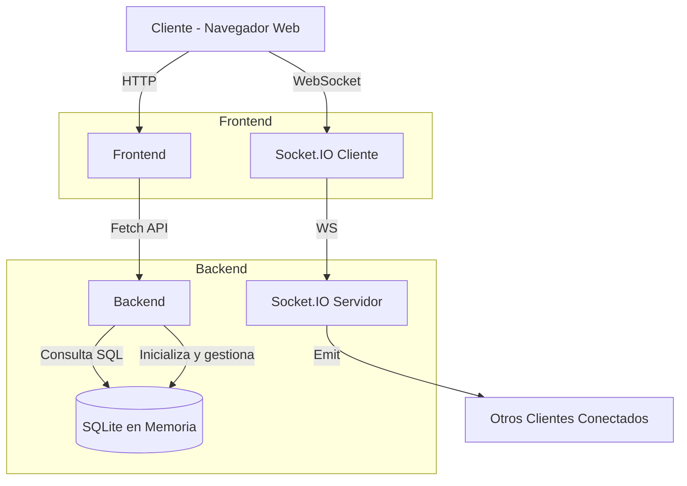

# 🃏 PokePlan

**PokePlan** es una aplicación web de votación colaborativa al estilo *Planning Poker*, pensada para equipos de trabajo que desean estimar tareas de forma remota, rápida y divertida.

---

## 🚀 Características

- 🔒 Creación de tableros únicos con código.
- 🧑‍🤝‍🧑 Participación anónima con íconos personalizados.
- 📊 Votación con cartas estilo Fibonacci.
- 👑 Gestión especial para el dueño del tablero.
- 🔄 Actualización en tiempo real con **Socket.IO**.
- 🎨 Interfaz animada e interactiva con **Framer Motion**.

---

## 🧩 Estructura del proyecto

```
PokePlan/
├── backend/          # API Express + WebSocket + SQLite en memoria
│   ├── db.js
│   ├── server.js
│   ├── package.json
├── frontend/         # React + Vite (SPA)
│   ├── src/
│   │   ├── pages/    # Home, CreateBoard, JoinBoard, Board
│   │   ├── App.jsx
│   │   ├── main.jsx
│   ├── public/
│   ├── index.html
│   ├── package.json
├── package.json      # Ejecuta ambos servidores con `npm run dev`
```

---

## ⚙️ Instalación

### 1. Clona el repositorio

```bash
git clone https://github.com/tuusuario/PokePlan.git
cd PokePlan
```

### 2. Instala las dependencias

```bash
npm run install
```

> Esto instalará las dependencias de frontend y backend.

### 3. Ejecuta el proyecto

```bash
npm run dev
```

- Frontend: `http://localhost:5173`
- Backend/API: `http://localhost:3000`

---

## Arquitectura



---

## 📦 Tecnologías usadas

### Backend
- Node.js + Express
- SQLite en memoria (better-sqlite3)
- Socket.IO
- dotenv, cors

### Frontend
- React 19 + Vite
- React Router
- Framer Motion
- Socket.IO Client
- TailwindCSS (configurable)
- ESLint + Plugins

---

## 📌 Notas

- Los tableros se guardan en memoria, por lo tanto, **no persisten** al reiniciar el servidor.
- Ideal para demos, pruebas técnicas o equipos pequeños.

---

## 📝 Licencia

Este proyecto está bajo la Licencia ISC.
